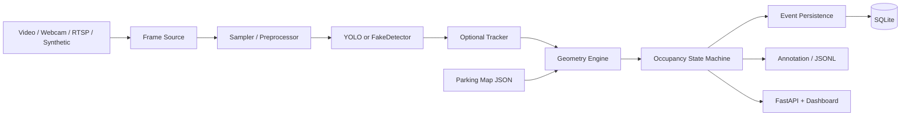

# Smart Parking-Space Detector

Fixed-camera parking-lot occupancy detection for portfolio and educational use.

Detect vehicles with YOLO (or a weight-free fake detector), score overlap against
manually configured parking polygons, stabilize occupancy with hysteresis, and
expose results through a CLI, SQLite events, FastAPI, and a lightweight dashboard.

> **License note:** This repository is **AGPL-3.0**. The default detector stack
> (Ultralytics YOLO) is also AGPL-3.0 for open-source use. Commercial or
> closed-source redistribution requires independent licensing review of both
> this project and its dependencies. This is not legal advice.

**Version:** 1.0.0 · **Python:** 3.11 · **Package manager:** [uv](https://docs.astral.sh/uv/)

## Problem

Drivers and operators need bay-level availability without installing a sensor in
every space. A fixed camera already sees the lot, but raw detections flicker,
boxes overlap multiple bays, and occupancy must stay stable over time. This
project turns camera frames plus a hand-drawn parking map into confirmed
`available` / `occupied` / `unknown` states, events, and analytics.

## Architecture



| Layer | Role |
| --- | --- |
| Sources | OpenCV file/webcam/stream + deterministic synthetic frames |
| Detection | Ultralytics YOLO adapter or `FakeDetector` (no weights) |
| Geometry | Shapely overlap scoring and one-to-one assignment |
| State | Enter/exit hysteresis and temporal confirmation |
| Pipeline | End-to-end process loop, annotated video, JSONL snapshots |
| Persistence | SQLite runs/events/analytics |
| API | `/health`, status, spaces, events, analytics, dashboard |

See [`docs/architecture.md`](docs/architecture.md) for a fuller data-flow description.

## Quick start (synthetic demo)

Works on **Windows**, **macOS**, and **Linux** once `uv` and Python 3.11 are available.
No YOLO weights, private footage, or GPU required for the default path.

```bash
# 1. Clone and install
git clone https://github.com/jt-09/smart-parking-space-detector.git
cd smart-parking-space-detector
uv python install 3.11
uv sync --locked --all-groups

# 2. Smoke the CLI
uv run smart-parking --help
uv run smart-parking --version

# 3. Weight-free synthetic pipeline (writes under output/)
uv run smart-parking process \
  --detector fake \
  --source synthetic \
  --parking-map configs/parking_spaces.example.json \
  --output-dir output \
  --no-save-video

# 4. Optional: annotated MP4 (local only — do not commit)
uv run smart-parking process \
  --detector fake \
  --source synthetic \
  --parking-map configs/parking_spaces.example.json \
  --output-dir output \
  --save-video

# 5. Throughput / metrics report (FakeDetector)
uv run smart-parking benchmark --frames 60 --report docs/assets/benchmark_report.txt

# 6. Status API + dashboard (localhost)
uv run smart-parking serve --config configs/app.example.yaml
```

Open `http://127.0.0.1:8000/` for the dashboard and `http://127.0.0.1:8000/health`
for a health check. Full smoke without weights:

```bash
uv run python scripts/smoke_test.py
```

### Platform notes

| Platform | Notes |
| --- | --- |
| Windows | PowerShell works; use `;` between commands. OpenCV GUI editor needs a desktop session. |
| macOS | Same `uv` flow. Grant camera permission only if using a webcam source. |
| Linux | Same `uv` flow. Headless hosts: use `--detector fake` / skip `edit-spaces` GUI. |

## Setup for real YOLO inference (optional)

```bash
uv sync --locked --all-groups
# First Ultralytics run may download weights into the local Ultralytics cache — never commit *.pt
uv run smart-parking process \
  --config configs/app.example.yaml \
  --source path/to/your/video.mp4 \
  --detector ultralytics \
  --output-dir output
```

Draw or edit polygons:

```bash
uv run smart-parking edit-spaces \
  --image path/to/reference_frame.jpg \
  --output configs/parking_spaces.json
```

## Results and evaluation

Accuracy and FPS claims must cite [`docs/evaluation.md`](docs/evaluation.md)
(hardware, config, and whether results are synthetic-only).

Example committed synthetic throughput template
([`docs/assets/benchmark_report.example.txt`](docs/assets/benchmark_report.example.txt)):

- ~408 e2e FPS / ~72 MiB peak RSS on a sample Windows AMD64 host (FakeDetector, 60 frames, 320×240)
- Occupied precision/recall on toy CSV fixtures are unit-tested; **≥90% on real footage is not claimed**

Regenerate locally rather than inventing numbers:

```bash
uv run smart-parking benchmark --frames 60 --report docs/assets/benchmark_report.txt
```

## Known limitations

- **Synthetic demo is the default.** Deterministic FakeDetector + synthetic frames power CI and the quick start. They are not a substitute for licensed site video.
- **Real footage is optional** and must never be committed. Portfolio clips stay local or owner-hosted.
- **Manual parking maps.** v1 does not auto-discover bays; polygons are configured by hand.
- **Fixed-camera MVP.** No multi-camera re-ID, LPR, billing, or enforcement-grade guarantees.
- **Docker image is heavy** because PyTorch/Ultralytics transitive dependencies pull large wheels even when you only run FakeDetector in the container.
- **CPU is the compatibility baseline;** GPU is optional and environment-specific.
- **Same-identity review** on GitHub PRs is not independent human approval.

## Privacy and licensing

- Do not commit credentials, `.env`, RTSP passwords, databases, model weights, or footage.
- Prefer synthetic media for demos; treat real video as potentially identifying.
- Details: [`docs/dataset-and-privacy.md`](docs/dataset-and-privacy.md), [`SECURITY.md`](SECURITY.md).
- Citation metadata: [`CITATION.cff`](CITATION.cff). Changelog: [`CHANGELOG.md`](CHANGELOG.md).

## Documentation

| Doc | Topic |
| --- | --- |
| [`docs/architecture.md`](docs/architecture.md) | System and data flow |
| [`docs/configuration.md`](docs/configuration.md) | Settings precedence and env vars |
| [`docs/dataset-and-privacy.md`](docs/dataset-and-privacy.md) | Media policy and privacy |
| [`docs/evaluation.md`](docs/evaluation.md) | Metrics and benchmarks |
| [`docs/troubleshooting.md`](docs/troubleshooting.md) | Common failures |
| [`docs/deployment.md`](docs/deployment.md) | Ops and containers |
| [`docs/development-timeline.md`](docs/development-timeline.md) | Genuine commit / PR history |
| [`SETUP.md`](SETUP.md) | Full delivery runbook |
| [`AGENTS.md`](AGENTS.md) | Autonomous agent rules |
| [`CONTRIBUTING.md`](CONTRIBUTING.md) | Contribution workflow |

Module guides: [detection](docs/detection.md), [editor](docs/editor.md),
[geometry](docs/geometry.md), [state](docs/state.md), [pipeline](docs/pipeline.md),
[persistence](docs/persistence.md), [api](docs/api.md).

## Quality gates

```bash
uv sync --locked --all-groups
uv run ruff format .
uv run ruff check .
uv run mypy src
uv run pytest --cov=smart_parking --cov-fail-under=85
uv run python scripts/smoke_test.py
uv run smart-parking --help
```

## Repository

- Source: https://github.com/jt-09/smart-parking-space-detector
- License: [AGPL-3.0](LICENSE)
