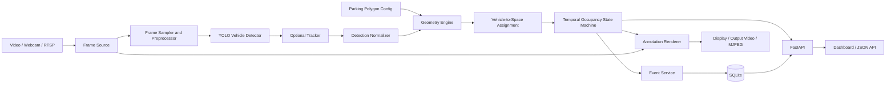
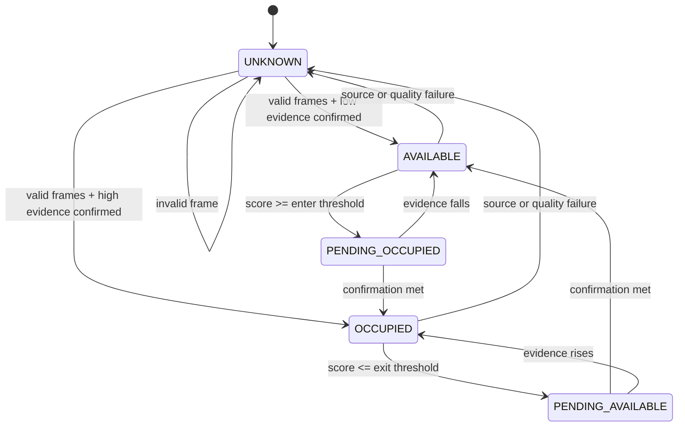

# Smart Parking-Space Detector — End-to-End Agent Setup and Delivery Plan

**Document version:** 1.1  
**Prepared:** 2026-07-29  
**Target repository name:** `smart-parking-space-detector`  
**Primary language:** Python 3.11  
**Default detector:** Ultralytics YOLO26 Nano, configurable  
**Primary use case:** Fixed-camera parking-lot occupancy detection  
**Default repository license:** AGPL-3.0, subject to the licensing decision below

---

## 0. Agent entrypoint — read this first

This file is the master implementation runbook. The implementation agent must read it fully before creating or changing code.

### Agent mission

Build, test, document, publish, and release a complete GitHub portfolio project that:

1. accepts a prerecorded video, webcam, local stream, or RTSP camera source;
2. detects and optionally tracks vehicles with YOLO;
3. loads manually configured parking-space polygons;
4. determines whether each parking space is available, occupied, or unknown;
5. stabilizes state changes with hysteresis and temporal smoothing;
6. records occupancy events and parking durations;
7. produces annotated video and machine-readable analytics;
8. exposes a CLI and a small web API/dashboard;
9. includes automated tests, CI, Docker support, security controls, and documentation;
10. is built through issues, branches, incremental commits, pull requests, review passes, and merges rather than direct pushes to `main`.

### Non-negotiable execution rules

- Do not push feature work directly to `main`.
- Do not combine the entire project into one commit or one pull request.
- Do not fabricate, backdate, or rewrite commit timestamps to imitate human activity.
- Do not claim a formal independent approval when the same identity authored and reviewed the PR.
- Do not commit model weights, private footage, credentials, API tokens, database files, generated videos, or personally identifying data.
- Do not merge while required checks are failing, pending, or missing.
- Do not silently weaken tests or thresholds merely to make CI pass.
- Every phase must finish with its acceptance criteria met, its issue updated, its PR reviewed, and its branch merged.
- Prefer small, reversible commits that each leave the repository in a working state.
- Use the user's installed **developmental commit timeline skill** before the first implementation commit and at each PR boundary. If the exact skill name or interface differs, discover the installed skill and read its instructions. If the skill is unavailable, follow the fallback commit sequence in this document.
- The developmental timeline skill may organize and explain genuine development history. It must not manufacture dates, false authors, artificial delays, or fake collaboration.

### Required agent capabilities

The agent needs:

- filesystem and terminal access;
- Git;
- GitHub CLI (`gh`) authenticated with repository and workflow permissions;
- Python and `uv`;
- the ability to run tests and GitHub Actions;
- permission to create a repository, issues, labels, branches, PRs, releases, and branch rules;
- optional Docker access for the container phase.

If a required permission is unavailable, the agent must still complete all local work, document the exact blocked operation in the affected issue and PR, and provide the exact command the repository owner must run. It must not pretend the remote action succeeded.


### Human bootstrap required before the first agent run

For a Cursor Agents Window or Cloud Agent run, the repository must already exist and contain the bootstrap files. The human owner performs this one-time setup; the implementation agent performs the project work afterward.

1. Create a GitHub repository named `smart-parking-space-detector` with `main` as the default branch and Issues enabled.
2. Commit and push `SETUP.md`, `AGENTS.md`, `.cursor/environment.json`, `.cursor/install.sh`, `.cursor/rules/smart-parking.mdc`, `.cursor/commands/start-smart-parking.md`, `HUMAN_BOOTSTRAP.md`, and the minimal `README.md` from the bootstrap kit.
3. Connect Cursor's GitHub integration to this exact repository. A GitHub MCP connection is useful, but it does not replace repository checkout/push permissions or an authenticated `gh` CLI when the workflow calls `gh` commands.
4. Confirm the developmental commit timeline skill is installed and visible to the selected Cursor agent. The agent must discover its exact name and instructions rather than assuming an interface.
5. Start a Cloud Agent from the Agents Window against `main`, or use a local Agent if the cloud token cannot create issues, PRs, or merges.
6. Let Cursor configure the cloud environment from `.cursor/environment.json`. The install step is intentionally idempotent and installs `uv` plus Python 3.11; it synchronizes dependencies once `pyproject.toml` exists.
7. Do not require a human PR approval if the requirement is truly unattended merging. Instead require pull requests, passing status checks, linear history, and no force pushes. Cursor Bugbot or a separate agent review may be used as an advisory/review check, but the author must not claim that this is an independent human approval.
8. Do not enable required CI check names until the first workflow run has created those checks. Add them to the branch ruleset immediately after Phase 0 CI is present.
9. No real parking footage is required for implementation. The agent must generate deterministic synthetic video for tests and the default demo. A real fixed-camera clip is only required later for a portfolio-quality demonstration.
10. Do not commit real footage, model weights, tokens, `.env`, output videos, databases, or generated artifacts.

The full owner checklist and exact launch prompt are in [`HUMAN_BOOTSTRAP.md`](HUMAN_BOOTSTRAP.md).

---

## 1. Table of contents

1. [Project concept](#2-project-concept)
2. [Goals, users, and scope](#3-goals-users-and-scope)
3. [System architecture](#4-system-architecture)
4. [Occupancy algorithm](#5-occupancy-algorithm)
5. [Functional requirements](#6-functional-requirements)
6. [Non-functional requirements](#7-non-functional-requirements)
7. [Repository structure](#8-repository-structure)
8. [Technology choices](#9-technology-choices)
9. [Configuration design](#10-configuration-design)
10. [Data and database design](#11-data-and-database-design)
11. [CLI, API, and dashboard](#12-cli-api-and-dashboard)
12. [Testing and evaluation](#13-testing-and-evaluation)
13. [GitHub and agent workflow](#14-github-and-agent-workflow)
14. [Developmental commit timeline protocol](#15-developmental-commit-timeline-protocol)
15. [Phase and PR plan](#16-phase-and-pr-plan)
16. [CI, security, and release](#17-ci-security-and-release)
17. [Definition of done](#18-definition-of-done)
18. [Agent start-to-finish procedure](#19-agent-start-to-finish-procedure)
19. [Commands](#20-command-reference)
20. [Future upgrades](#21-post-v1-roadmap)
21. [References](#22-official-links-and-references)

---

## 2. Project concept

### Problem

Drivers and parking operators need a reliable way to determine which parking spaces are available without installing a physical sensor in every bay. A fixed camera already provides enough information for a computer-vision system to estimate occupancy, but raw object detection is not sufficient. Vehicle detections flicker, bounding boxes overlap multiple bays, shadows and occlusion create uncertainty, and the system must maintain stable state over time.

### Proposed solution

The system processes a fixed-camera video stream and overlays a predefined polygon on every parking space. A YOLO model detects vehicles. The occupancy engine calculates how strongly each detected vehicle overlaps each parking polygon, assigns detections to spaces, applies temporal state logic, and records meaningful transitions such as `occupied` and `vacated`.

The system then provides:

- a live or saved annotated view;
- available and occupied counts;
- occupancy percentage;
- per-space status and confidence;
- arrival, departure, and duration events;
- basic historical analytics;
- JSON/CSV outputs and API endpoints.

### Why this is a strong portfolio project

It demonstrates more than a model demo. It combines:

- real-time video processing;
- object detection and tracking;
- computational geometry;
- temporal state machines;
- persistence and analytics;
- software architecture and testing;
- CI/CD and GitHub workflow automation;
- reproducible deployment.

---

## 3. Goals, users, and scope

### Primary user stories

- As an operator, I can configure parking-space polygons from a reference frame.
- As an operator, I can run the detector on a local video and receive an annotated output video.
- As an operator, I can see current available, occupied, and unknown counts.
- As an operator, I can inspect the status and confidence of each named space.
- As an analyst, I can query occupancy events and calculate parking duration and turnover.
- As a developer, I can run the project locally with documented commands.
- As a maintainer, I can change the detector model and thresholds without changing application code.
- As a reviewer, I can validate the algorithm through deterministic tests and benchmark fixtures.

### Version 1 goals

- Fixed camera.
- Manually drawn parking polygons stored in JSON.
- Pretrained YOLO vehicle detection.
- Optional multi-object tracking.
- Polygon-overlap occupancy scoring.
- One-to-one vehicle-to-space assignment.
- Stable state transitions using hysteresis and frame/time confirmation.
- SQLite event history.
- CLI processing workflow.
- FastAPI status and analytics endpoints.
- Lightweight dashboard or server-rendered status page.
- CI, linting, typing, tests, Docker image, documentation, and tagged release.

### Explicit non-goals for version 1

- Automatic discovery of parking-space geometry.
- License-plate recognition.
- Facial recognition or person identification.
- Billing or payment processing.
- Navigation to a specific bay.
- Guaranteed safety-critical or enforcement-grade accuracy.
- Multi-camera identity re-identification.
- Cloud infrastructure provisioning.
- Mobile applications.

These may appear only in the post-v1 roadmap.

---

## 4. System architecture



### Component responsibilities

#### Frame source

Provides a common iterator/interface for:

- local image;
- local video;
- integer webcam index;
- RTSP or HTTP stream;
- synthetic test frames.

It owns reconnect logic, frame timestamps, source metadata, and graceful shutdown.

#### Detector

Loads a configurable Ultralytics YOLO model and returns normalized detections:

```text
class_id, class_name, confidence, x1, y1, x2, y2, optional_track_id
```

Only configured vehicle classes are retained. The default classes are car, motorcycle, bus, and truck.

#### Tracker

Tracking is optional for the basic occupancy calculation but useful for event attribution, reduced duplicate transitions, and future analytics. Use the tracker supported by the installed Ultralytics release. Keep the tracker behind an interface so it can be replaced.

#### Geometry engine

Creates validated Shapely polygons and computes:

- parking-space area;
- detection footprint;
- intersection area;
- overlap ratios;
- centre or bottom-centre containment;
- candidate assignments.

#### Assignment engine

A vehicle should not occupy multiple spaces merely because its bounding box overlaps several polygons. Build a score matrix between active detections and spaces, reject scores below a candidate threshold, then make one-to-one assignments. A deterministic greedy maximum-score assignment is acceptable for v1; the implementation must make it replaceable with Hungarian assignment later.

#### State machine

Raw occupancy evidence must not directly change the displayed state. Each space maintains a state, confidence, evidence history, transition timer, and last confirmed change.

#### Event service

Creates an event only when a confirmed state transition occurs. It must be idempotent for a frame/run and prevent duplicate events caused by retries.

#### Renderer

Draws polygons, labels, state, confidence, vehicle detections, track IDs, counts, FPS, and run metadata. Rendering must not contain business logic.

#### API/dashboard

Reads the current in-memory snapshot and persisted event history. Video streaming is optional but useful. API endpoints must continue to work when no GUI display is available.

---

## 5. Occupancy algorithm

### 5.1 Parking-space representation

Each space is a named polygon:

```json
{
  "camera_id": "lot-a-camera-01",
  "reference_resolution": [1920, 1080],
  "spaces": [
    {
      "id": "A-001",
      "label": "A1",
      "polygon": [[110, 430], [270, 420], [305, 650], [90, 665]],
      "enabled": true,
      "metadata": {"zone": "A", "reserved": false}
    }
  ]
}
```

Polygons must:

- contain at least three unique points;
- be valid and non-self-intersecting;
- have positive area;
- fit within the reference resolution;
- have unique IDs;
- be normalized or scaled if input resolution changes.

### 5.2 Vehicle footprint

The v1 footprint is the YOLO bounding-box rectangle represented as a polygon. Because elevated cameras often produce a bounding box that includes background above the vehicle, support an optional `footprint_height_ratio`, such as the lower 60% of the box.

Future segmentation models can provide a mask footprint without changing the occupancy interface.

### 5.3 Scores

For vehicle polygon `V` and parking polygon `P`:

```text
intersection_area = area(V ∩ P)
space_overlap     = intersection_area / area(P)
vehicle_overlap   = intersection_area / area(V)
```

Create a combined score:

```text
score = w_space * space_overlap
      + w_vehicle * vehicle_overlap
      + w_center * centre_inside
      + w_bottom * bottom_centre_inside
```

Recommended initial weights:

```text
w_space   = 0.55
w_vehicle = 0.20
w_center  = 0.10
w_bottom  = 0.15
```

All values must be configurable. Tests must validate the exact formula.

### 5.4 Candidate and assignment thresholds

Initial defaults for experimentation, not guaranteed production values:

```text
candidate_score_threshold = 0.18
occupied_enter_threshold  = 0.30
occupied_exit_threshold   = 0.12
```

Using separate enter and exit thresholds creates hysteresis and reduces flicker.

### 5.5 One-to-one assignment

For each frame:

1. Build the detection-to-space score matrix.
2. Discard pairs below the candidate threshold.
3. Sort remaining pairs by descending score.
4. Select a pair only if neither its vehicle nor its space has already been assigned.
5. Record the chosen score as raw occupancy evidence.
6. Unassigned spaces receive zero evidence or an `unknown` observation when the frame is unreliable.

The order must be deterministic for equal scores, using space ID and detection index as tie-breakers.

### 5.6 Reliability and unknown state

A space should become `unknown`, not incorrectly available, when:

- the camera source is disconnected;
- frame age exceeds a configured limit;
- the parking polygon is invalid;
- detector inference fails;
- the frame is mostly dark or blurred and quality checks are enabled;
- the space is heavily occluded by a configured exclusion zone;
- the reference resolution cannot be reconciled with the input.

### 5.7 Temporal state machine



Support confirmation by frames and elapsed time:

```text
enter_confirm_frames = 5
exit_confirm_frames = 8
enter_confirm_seconds = 0.5
exit_confirm_seconds = 1.0
```

Use whichever configured mode is active. Time-based confirmation is preferred for streams with variable FPS.

### 5.8 Events

Confirmed transitions create events:

- `space_occupied`;
- `space_vacated`;
- `space_unknown`;
- `space_restored`;
- `source_connected`;
- `source_disconnected`;
- `run_started`;
- `run_completed`;
- `run_failed`.

An occupied period begins at the confirmed occupied timestamp and ends at the confirmed vacated timestamp. Retain the raw transition start timestamp as metadata so event latency can be measured.

---

## 6. Functional requirements

### FR-01 Source handling

The application must accept:

```text
--source path/to/video.mp4
--source 0
--source rtsp://...
--source path/to/image.jpg
```

Secrets in RTSP URLs must be provided through environment variables or a local ignored configuration file.

### FR-02 Polygon configuration

The application must load and validate a JSON parking map. A polygon editor must allow users to:

- select a reference frame;
- click points to create a polygon;
- name the space;
- undo a point;
- delete or disable a space;
- save valid JSON;
- reload and edit existing polygons.

A browser-based or OpenCV desktop editor is acceptable. The selected approach must have automated validation even if interaction is manually tested.

### FR-03 Detection

The system must:

- configure model path/name, device, confidence, IoU, and allowed classes;
- normalize detector outputs;
- support CPU execution;
- use GPU automatically only when requested or explicitly configured;
- record model and inference configuration in every processing run.

### FR-04 Occupancy

The system must produce a snapshot containing:

```json
{
  "timestamp": "2026-07-29T08:30:00Z",
  "camera_id": "lot-a-camera-01",
  "available": 12,
  "occupied": 26,
  "unknown": 2,
  "occupancy_percent": 65.0,
  "spaces": []
}
```

Unknown spaces must be excluded from the denominator by default, with a configuration option to change that behavior.

### FR-05 Event history

Store confirmed transitions and expose:

- current session events;
- events by time range;
- events by space;
- parking durations;
- hourly occupancy summaries;
- turnover count.

### FR-06 Output

Support:

- annotated MP4;
- JSONL snapshots;
- CSV events;
- optional display window;
- API/dashboard mode;
- structured logs.

### FR-07 Graceful operation

Handle Ctrl+C, end-of-file, source loss, model errors, and database errors without corrupting the output. Finalize the processing run and release camera/video resources.

---

## 7. Non-functional requirements

### Accuracy

The v1 acceptance dataset must achieve:

- per-space occupancy accuracy of at least 90% on the selected demo video;
- confirmed state transition precision of at least 90%;
- no more than one false state flip per space per ten minutes on the demo video;
- event latency reported, not hidden.

These are project acceptance targets, not universal claims.

### Performance

On the documented test machine:

- report decode FPS, inference FPS, end-to-end FPS, and peak memory;
- support frame sampling;
- avoid unbounded queues and histories;
- provide a low-resource CPU configuration.

Do not place an arbitrary FPS claim in the README without benchmark hardware and settings.

### Maintainability

- typed public interfaces;
- dependency injection for detector, clock, source, and repository in tests;
- no business logic in CLI or drawing code;
- configuration validated at startup;
- small modules with clear ownership;
- `ruff`, `mypy`, and `pytest` clean.

### Reproducibility

- commit `pyproject.toml` and `uv.lock`;
- pin GitHub Actions by stable major versions, and use Dependabot for updates;
- record model name and hash when practical;
- store demo configuration and expected metrics;
- generate synthetic fixtures in tests rather than committing large media.

### Privacy

- no face recognition;
- no plate recognition in v1;
- no raw private footage in Git;
- configurable event retention;
- document camera consent, signage, and local legal requirements;
- blur or crop identifying content in public demo assets when necessary.

---

## 8. Repository structure

The agent should create this target structure, adjusting only when justified in the relevant PR:

```text
smart-parking-space-detector/
├── .github/
│   ├── ISSUE_TEMPLATE/
│   │   ├── bug_report.yml
│   │   └── feature_request.yml
│   ├── workflows/
│   │   ├── ci.yml
│   │   ├── codeql.yml
│   │   └── release.yml
│   ├── CODEOWNERS
│   ├── dependabot.yml
│   └── pull_request_template.md
├── configs/
│   ├── app.example.yaml
│   ├── cameras.example.yaml
│   └── parking_spaces.example.json
├── data/
│   └── README.md
├── docker/
│   └── entrypoint.sh
├── docs/
│   ├── architecture.md
│   ├── configuration.md
│   ├── dataset-and-privacy.md
│   ├── development-timeline.md
│   ├── evaluation.md
│   ├── git-workflow.md
│   ├── troubleshooting.md
│   └── assets/
├── scripts/
│   ├── benchmark.py
│   ├── export_events.py
│   ├── generate_test_video.py
│   └── smoke_test.py
├── src/
│   └── smart_parking/
│       ├── __init__.py
│       ├── api/
│       │   ├── app.py
│       │   ├── dependencies.py
│       │   ├── schemas.py
│       │   └── routes.py
│       ├── cli/
│       │   └── main.py
│       ├── config/
│       │   ├── loader.py
│       │   └── models.py
│       ├── detection/
│       │   ├── base.py
│       │   ├── models.py
│       │   └── ultralytics_detector.py
│       ├── domain/
│       │   ├── events.py
│       │   ├── parking.py
│       │   └── state.py
│       ├── geometry/
│       │   ├── assignment.py
│       │   ├── overlap.py
│       │   └── validation.py
│       ├── occupancy/
│       │   ├── engine.py
│       │   └── state_machine.py
│       ├── persistence/
│       │   ├── database.py
│       │   ├── models.py
│       │   └── repositories.py
│       ├── pipeline/
│       │   ├── processor.py
│       │   └── snapshot.py
│       ├── rendering/
│       │   ├── colors.py
│       │   └── renderer.py
│       ├── sources/
│       │   ├── base.py
│       │   └── opencv_source.py
│       └── tools/
│           └── polygon_editor.py
├── tests/
│   ├── contract/
│   ├── integration/
│   ├── unit/
│   ├── fixtures/
│   └── conftest.py
├── .dockerignore
├── .env.example
├── .gitignore
├── .pre-commit-config.yaml
├── AGENTS.md
├── CHANGELOG.md
├── CITATION.cff
├── CODE_OF_CONDUCT.md
├── CONTRIBUTING.md
├── Dockerfile
├── LICENSE
├── Makefile
├── README.md
├── SECURITY.md
├── SETUP.md
├── pyproject.toml
└── uv.lock
```

`SETUP.md` in the repository should contain this runbook or a maintained adaptation of it. `AGENTS.md` should summarize the agent-specific rules and link back to `SETUP.md`.

---

## 9. Technology choices

### Core

- **Python 3.11:** conservative compatibility target for computer-vision packages.
- **OpenCV:** video decode/encode, image operations, drawing, camera access.
- **Ultralytics YOLO:** vehicle detection and optional tracking.
- **Shapely:** robust polygon construction and intersection calculations.
- **NumPy:** arrays and numeric operations.

### Application

- **Pydantic / pydantic-settings:** validated configuration and API models.
- **SQLAlchemy + SQLite:** event persistence and testable repository layer.
- **Typer:** CLI.
- **FastAPI + Uvicorn:** API and lightweight dashboard backend.
- **Jinja2 or a small static page:** dashboard; do not introduce a full JavaScript framework for v1.
- **Rich:** readable CLI logging and tables, optional.

### Quality

- **uv:** environment, dependency, and lockfile management.
- **pytest + pytest-cov:** testing and coverage.
- **Ruff:** formatting and linting.
- **mypy:** static type checks.
- **pre-commit:** local quality hooks.
- **GitHub Actions:** CI and release automation.
- **CodeQL, Dependabot, secret scanning:** repository security where available.

### Dependency policy

- Add dependencies only in the PR that first uses them.
- Explain heavyweight dependencies in the PR body.
- Commit the updated lockfile with dependency changes.
- Do not install both `opencv-python` and `opencv-python-headless` in the same environment.
- Use `opencv-python` for the default local project because the polygon editor may need desktop interaction. The Docker image may use a headless dependency strategy if the lock and extras are designed cleanly.
- Do not commit YOLO `.pt`, `.onnx`, `.engine`, or other model artifacts.

### Ultralytics licensing decision

Ultralytics currently documents AGPL-3.0 and Enterprise licensing options. The default open-source educational repository should therefore use **AGPL-3.0** unless the owner deliberately chooses a different detector or obtains an appropriate commercial license.

The agent must:

1. add a licensing note to the README;
2. use AGPL-3.0 by default for this repository;
3. avoid stating that an MIT or Apache license automatically resolves the dependency's license obligations;
4. direct commercial or closed-source users to review Ultralytics licensing and obtain legal advice;
5. record any detector substitution in an architecture decision note.

This document is not legal advice.

---

## 10. Configuration design

Use layered configuration:

1. safe application defaults;
2. YAML file;
3. `.env` values;
4. CLI overrides.

Precedence must be documented and tested.

Example configuration:

```yaml
app:
  environment: development
  log_level: INFO
  output_dir: output

camera:
  id: lot-a-camera-01
  source: data/sample.mp4
  reconnect_seconds: 5
  max_frame_age_seconds: 3

video:
  process_every_n_frames: 1
  output_fps: null
  resize_width: null
  display: false
  save_annotated_video: true

model:
  name: yolo26n.pt
  device: cpu
  confidence: 0.30
  iou: 0.50
  allowed_classes: [car, motorcycle, bus, truck]
  tracking_enabled: true
  tracker: null

geometry:
  parking_map: configs/parking_spaces.example.json
  footprint_height_ratio: 0.60
  candidate_score_threshold: 0.18
  occupied_enter_threshold: 0.30
  occupied_exit_threshold: 0.12
  weight_space_overlap: 0.55
  weight_vehicle_overlap: 0.20
  weight_center_inside: 0.10
  weight_bottom_center_inside: 0.15

state:
  mode: frames
  enter_confirm_frames: 5
  exit_confirm_frames: 8
  enter_confirm_seconds: 0.5
  exit_confirm_seconds: 1.0
  unknown_after_invalid_frames: 10

persistence:
  database_url: sqlite:///output/parking.db
  snapshot_interval_seconds: 5
  event_retention_days: 90

api:
  host: 127.0.0.1
  port: 8000
```

### Secret handling

- `.env` is ignored.
- `.env.example` contains names but no credentials.
- RTSP usernames/passwords use environment variables.
- GitHub secrets are used only for release/deployment actions that require them.
- The application must redact credentials in logs.

---

## 11. Data and database design

### Tables

#### `processing_runs`

```text
id UUID primary key
camera_id text
source_fingerprint text
started_at timestamp UTC
ended_at timestamp UTC nullable
status text
model_name text
model_version text nullable
config_json text
frames_read integer
frames_processed integer
error_message text nullable
```

#### `parking_spaces`

```text
id text primary key
camera_id text
label text
polygon_json text
zone text nullable
enabled boolean
metadata_json text
created_at timestamp UTC
updated_at timestamp UTC
```

#### `occupancy_events`

```text
id UUID primary key
run_id UUID
space_id text
event_type text
previous_state text
new_state text
confirmed_at timestamp UTC
raw_transition_started_at timestamp UTC nullable
confidence float
track_id text nullable
metadata_json text
idempotency_key text unique
```

#### `occupancy_snapshots`

Optional for v1; use only at a configured interval, not every frame.

```text
id UUID primary key
run_id UUID
captured_at timestamp UTC
available integer
occupied integer
unknown integer
occupancy_percent float
spaces_json text
```

### Time

- Store timestamps in UTC.
- Display local time only at presentation boundaries.
- Tests must use an injected clock.

### Data retention

- Raw frames are not stored by default.
- Output video retention is an operator decision.
- Event deletion/retention command should be documented.
- Public demos must use footage with permission or an appropriately licensed dataset.

### Candidate datasets

- PKLot can support experimentation and comparison.
- CNRPark+EXT can support parking-space occupancy research.
- The agent must read and comply with each dataset's license and attribution terms before downloading or redistributing it.
- Do not place full datasets in Git. Add download instructions and checksums or source references.

---

## 12. CLI, API, and dashboard

### CLI commands

Target interface:

```bash
smart-parking validate-config --config configs/app.yaml
smart-parking edit-spaces --source data/reference.jpg --output configs/spaces.json
smart-parking process --config configs/app.yaml --source data/sample.mp4
smart-parking serve --config configs/app.yaml
smart-parking export-events --format csv --output output/events.csv
smart-parking benchmark --config configs/app.yaml --source data/sample.mp4
smart-parking db migrate
smart-parking db purge --before 2026-01-01
```

Every command must have `--help`, non-zero exit codes on failure, and structured logs.

### API endpoints

Version under `/api/v1`:

```text
GET  /health
GET  /api/v1/status
GET  /api/v1/spaces
GET  /api/v1/spaces/{space_id}
GET  /api/v1/events
GET  /api/v1/analytics/occupancy
GET  /api/v1/analytics/turnover
GET  /api/v1/runs
GET  /api/v1/runs/{run_id}
```

Optional:

```text
GET /stream.mjpg
```

### Dashboard

The dashboard should show:

- current total, available, occupied, and unknown counts;
- occupancy percentage;
- a space grid/table with state and confidence;
- latest events;
- hourly occupancy chart;
- current source/model status;
- timestamp of the latest valid frame.

Keep the frontend simple and accessible. API correctness is more important than visual complexity.

---

## 13. Testing and evaluation

### Unit tests

Must cover:

- polygon validation;
- coordinate scaling;
- vehicle footprint conversion;
- exact overlap calculations;
- score weighting;
- deterministic assignment;
- enter/exit hysteresis;
- frame- and time-based confirmation;
- unknown state behavior;
- duplicate event prevention;
- occupancy percentage denominator;
- configuration precedence and validation.

### Contract tests

Create a fake detector implementing the detector protocol and verify that the pipeline accepts it. Add a minimal Ultralytics adapter contract test that can be skipped when model download is unavailable.

### Integration tests

- Generate a small synthetic video with moving rectangles.
- Define two or three synthetic parking polygons.
- Use a deterministic fake detector.
- Process the video end to end.
- Assert expected transition order and output files.
- Test SQLite migrations and API responses.

### Smoke test

A separate script should:

1. import the package;
2. validate example configuration;
3. generate synthetic media;
4. run a short pipeline;
5. start the API with a test client;
6. confirm outputs.

### Coverage

Initial required line coverage: **85%** for project-owned Python code. Exclude generated migrations and trivial package metadata only with justification.

Coverage is a floor, not a substitute for meaningful assertions.

### Evaluation set

Create a small manually verified benchmark segment with a CSV or JSON ground truth:

```text
frame_or_time,space_id,expected_state
0.0,A-001,available
3.2,A-001,occupied
18.7,A-001,available
```

Report:

- per-space accuracy;
- macro accuracy;
- precision/recall/F1 for occupied;
- state-transition precision and recall;
- false flips;
- mean and p95 transition latency;
- processing FPS and hardware.

The README must label results as specific to the documented footage, camera, model, thresholds, and hardware.

### Manual acceptance tests

- Draw and save polygons.
- Reload and edit polygons.
- Process a video to completion.
- Interrupt processing safely.
- Run without a display.
- Run API and view status.
- Simulate source loss.
- Confirm no secrets appear in logs.
- Confirm model weights and videos are ignored by Git.

---

## 14. GitHub and agent workflow

### Repository variables

Before starting, set:

```bash
export GITHUB_OWNER="YOUR_GITHUB_USERNAME_OR_ORG"
export REPO_NAME="smart-parking-space-detector"
export REPO_VISIBILITY="public"
export AGENT_ID="your-agent/your-model"
```

The agent must not invent the owner. It should read it from authenticated GitHub context or the provided environment.

### Initial bootstrap exception

An empty Git repository needs a root commit before normal PR enforcement can begin. The only allowed direct `main` push is the minimal repository bootstrap containing:

- this `SETUP.md`;
- a minimal `README.md` that points to `SETUP.md`;
- `.gitignore` protecting secrets, media, databases, model weights, and outputs.

Commit message:

```text
docs: add project implementation runbook
```

After pushing the root commit, configure branch protection/rules and use PRs exclusively.

### Branch strategy

Use short-lived branches from an up-to-date `main`:

```text
chore/<topic>
feat/<topic>
fix/<topic>
test/<topic>
docs/<topic>
perf/<topic>
refactor/<topic>
```

Examples:

```text
chore/project-scaffold
feat/parking-map-editor
feat/yolo-detector
feat/occupancy-engine
feat/event-history
feat/api-dashboard
perf/pipeline-benchmark
chore/release-v1
```

Never reuse a merged branch.

### Commit format

Use Conventional Commits:

```text
<type>(optional-scope): imperative summary
```

Examples:

```text
feat(geometry): compute vehicle-space overlap scores
test(state): cover hysteresis transition cancellation
fix(source): release video capture after decode failure
docs(api): add endpoint examples
chore(ci): run quality and integration checks
```

Rules:

- one logical change per commit;
- tests accompany behavior in the same commit or the immediately following test commit within the same PR;
- no `WIP`, `stuff`, `changes`, or generic messages;
- do not commit broken intermediate states;
- include the agent transparency trailer when configured:

```text
Assisted-by: your-agent/your-model
```

Use the repository owner's configured Git identity. Do not replace it with a fake human identity.

### Issue workflow

Before each PR:

1. create or locate the corresponding issue;
2. include scope, acceptance criteria, risks, and out-of-scope items;
3. assign the correct phase milestone and labels;
4. create the branch from current `main`;
5. reference the issue in commits when useful;
6. include `Closes #<issue>` in the PR body.

Recommended labels:

```text
area:api
area:ci
area:data
area:detection
area:docs
area:geometry
area:persistence
area:pipeline
area:ui
priority:p0
priority:p1
priority:p2
type:bug
type:chore
type:docs
type:feature
type:performance
type:test
status:blocked
status:needs-review
```

### Pull request requirements

Every PR must include:

- concise purpose and user impact;
- linked issue;
- architectural notes;
- ordered list of key changes;
- exact test commands and results;
- screenshots or a short generated artifact for visual changes;
- performance impact if relevant;
- data/privacy implications;
- known limitations;
- checklist confirming documentation and changelog updates where applicable;
- a `Development timeline` subsection summarizing the genuine commit sequence.

### Review protocol

The implementation agent must perform a separate review pass after implementation:

1. reset context or invoke a review sub-agent when supported;
2. inspect the complete diff against `main`;
3. review correctness, edge cases, tests, typing, security, privacy, dependency changes, and documentation;
4. write findings in the PR as a comment or review artifact;
5. fix all blocking findings on the same branch;
6. rerun checks after the final fix;
7. resolve all PR conversations.

Do not label the same-identity review as independent approval. Automated and self-review evidence is still useful but must be described accurately.

### Merge policy

Use **rebase merge** so the incremental commits remain visible in a linear `main` history:

```bash
gh pr checks <PR_NUMBER> --watch
gh pr merge <PR_NUMBER> --rebase --delete-branch
```

Use auto-merge only when branch rules and checks are correctly configured:

```bash
gh pr merge <PR_NUMBER> --rebase --auto --delete-branch
```

Before merge:

- branch is current with `main`;
- no merge conflicts;
- required checks pass;
- review pass completed;
- blocking findings resolved;
- issue acceptance criteria met;
- docs and examples updated;
- generated artifacts are not accidentally committed.

After merge:

- pull latest `main`;
- verify the merge and issue closure;
- delete local branch;
- update `docs/development-timeline.md` in the next relevant PR if the timeline skill requires it;
- start the next phase only from updated `main`.

### Branch protection target

Configure `main` with:

- pull requests required;
- required status checks;
- branches required to be up to date;
- conversation resolution required;
- linear history required;
- force pushes disabled;
- branch deletion disabled;
- administrator bypass disabled when practical;
- zero mandatory human approvals for a fully autonomous solo-agent repository, unless a real reviewer is available.

The quality gate is automated checks plus the documented review pass. Do not configure a mandatory approval that the authorized agent cannot legitimately provide, because it would prevent start-to-finish execution.

Recommended required checks after CI exists:

```text
quality
unit-tests
integration-tests
build
```

### GitHub Projects and milestones

Create milestones:

```text
M0 Foundation
M1 Detection Pipeline
M2 Occupancy Intelligence
M3 Analytics and Interface
M4 Production Readiness
v1.0.0
```

A GitHub Project board is optional. If created, use columns/status values:

```text
Backlog → Ready → In progress → In review → Done
```

---

## 15. Developmental commit timeline protocol

### Owner-required commit window

This autonomous run must plan and execute developmental commits inside:

```text
Start: 2026-07-22T09:00:00+10:00
End:   2026-07-28T22:00:00+10:00
```

Record the window in `AGENTS.md`, every skill commit proposal, each PR `Development timeline` subsection, and `docs/development-timeline.md`. Spread genuine phase milestones across that window with uneven gaps. Do not invent collaborators or fake review identities. Author and committer identity remain the authenticated repository owner.

### Skill invocation

The user has a developmental commit timeline skill. The agent must:

1. discover the installed skill before implementation;
2. read its instructions rather than guessing its interface;
3. use it to split work into logical, pedagogically useful commits inside the owner-required window above;
4. use it to generate or update `docs/development-timeline.md` if supported;
5. use it at the start and end of every PR;
6. verify that generated descriptions match the actual diff and history;
7. never invent collaborators, fake authors, or contribution history outside the planned window.

### Fallback behavior

When the skill is unavailable, each PR must follow this commit progression where applicable:

1. domain/interface or test fixture;
2. core behavior;
3. tests for behavior and edge cases;
4. integration wiring;
5. docs/config/examples;
6. review fixes.

Not every PR needs six commits, but most implementation PRs should have two to five meaningful commits.

### Timeline documentation format

`docs/development-timeline.md` should contain genuine milestones:

```markdown
## PR #4 — YOLO detector adapter

- Introduced the detector protocol and normalized detection model.
- Added an Ultralytics adapter without coupling domain logic to the library.
- Added fake-detector contract tests and a model-download-optional smoke test.
- Added detector configuration and troubleshooting notes.

Architecture impact: the pipeline can now switch detector implementations.
```

Do not record invented dates. Git already records actual commit and merge timestamps.

---

## 16. Phase and PR plan

The following sequence is the required default. The agent may split a PR that becomes too large, but it must not collapse phases into a single mega-PR.

### Phase 0 — Repository bootstrap

#### Direct root commit

**Commit:** `docs: add project implementation runbook`

Contents:

- `SETUP.md`;
- minimal `README.md`;
- protective `.gitignore`.

Then create the remote repository, push `main`, create labels/milestones, and apply branch rules.

#### PR 1 — Project foundation

**Issue:** `Establish project scaffold and engineering standards`  
**Branch:** `chore/project-scaffold`  
**PR title:** `chore: establish project scaffold and quality tooling`

Scope:

- `pyproject.toml` and `uv.lock`;
- `src` layout and package metadata;
- Ruff, mypy, pytest, coverage, pre-commit;
- Makefile task aliases;
- contribution, security, code of conduct, changelog, license;
- GitHub templates;
- initial CI with quality and empty/smoke tests;
- AGPL licensing note;
- `AGENTS.md` linking to this document.

Suggested commits:

```text
chore: initialize Python project with uv
chore(quality): configure linting typing and tests
chore(github): add issue and pull request templates
docs: add contribution security and licensing guidance
```

Acceptance:

- `uv sync` succeeds;
- `uv run ruff check .` succeeds;
- `uv run ruff format --check .` succeeds;
- `uv run mypy src` succeeds;
- `uv run pytest` succeeds;
- CI runs on the PR;
- repository rules identify the CI checks.

---

### Phase 1 — Domain model and configuration

#### PR 2 — Domain and config

**Issue:** `Define parking, detection, event, and configuration models`  
**Branch:** `feat/domain-and-config`  
**PR title:** `feat: add validated domain and application configuration`

Scope:

- typed domain models for boxes, detections, spaces, snapshots, states, and events;
- Pydantic configuration models;
- YAML/env/CLI precedence design;
- example configuration and parking map;
- UTC clock abstraction;
- validation errors with actionable messages.

Suggested commits:

```text
feat(domain): define parking detection and event models
feat(config): add validated layered application settings
test(config): cover precedence and invalid parking maps
docs(config): document configuration and secret handling
```

Acceptance:

- invalid polygons and duplicate IDs fail clearly;
- environment overrides are tested;
- no dependency on OpenCV or Ultralytics leaks into domain models;
- examples load successfully.

---

### Phase 2 — Video sources and polygon tooling

#### PR 3 — Frame sources

**Issue:** `Implement image, video, webcam, and stream frame sources`  
**Branch:** `feat/frame-sources`  
**PR title:** `feat: add OpenCV frame-source abstraction`

Scope:

- source protocol;
- OpenCV capture adapter;
- timestamps and frame metadata;
- EOF and disconnect handling;
- reconnect policy for streams;
- resource cleanup;
- synthetic source for tests.

Suggested commits:

```text
feat(source): define frame source protocol and metadata
feat(source): implement OpenCV video and camera capture
test(source): cover EOF errors and resource cleanup
```

Acceptance:

- local video and synthetic source process correctly;
- capture is released on completion and failure;
- credentials are redacted from source logs;
- stream retry behavior is bounded and configurable.

#### PR 4 — Parking polygon editor

**Issue:** `Create a parking-space polygon editor and validator`  
**Branch:** `feat/parking-map-editor`  
**PR title:** `feat: add parking-space map editor`

Scope:

- interactive polygon drawing;
- labels and IDs;
- undo/delete/disable;
- JSON serialization;
- resolution metadata;
- coordinate scaling preview;
- documented keyboard/mouse controls.

Suggested commits:

```text
feat(spaces): add parking map serialization and scaling
feat(editor): implement interactive polygon editing
test(spaces): cover polygon validation and round trips
docs(editor): add parking map creation guide
```

Acceptance:

- generated map validates through CLI;
- reload/save round trip preserves geometry;
- invalid or self-crossing polygons cannot be saved unnoticed;
- manual test steps and screenshot are attached to the PR.

---

### Phase 3 — Vehicle detection and tracking

#### PR 5 — Detector abstraction and YOLO adapter

**Issue:** `Add configurable YOLO vehicle detection`  
**Branch:** `feat/yolo-detector`  
**PR title:** `feat: add YOLO vehicle detector adapter`

Scope:

- detector protocol;
- normalized output model;
- Ultralytics adapter;
- class filtering;
- configurable model, confidence, IoU, device;
- optional tracking with persistent track IDs;
- model-download behavior documented;
- fake detector for tests.

Suggested commits:

```text
feat(detection): define detector protocol and normalized outputs
feat(detection): implement Ultralytics YOLO adapter
feat(tracking): expose persistent track identifiers
test(detection): add adapter contracts and fake detector
docs(detection): document models devices and licensing
```

Acceptance:

- domain and pipeline code depend on the detector protocol, not Ultralytics types;
- CPU smoke test works when weights are available;
- tests can run without downloading weights;
- model weights are ignored by Git;
- logs show selected model and device.

---

### Phase 4 — Geometry and occupancy intelligence

#### PR 6 — Geometry scoring and assignment

**Issue:** `Calculate vehicle-space overlap and deterministic assignments`  
**Branch:** `feat/geometry-assignment`  
**PR title:** `feat: add polygon occupancy scoring and assignment`

Scope:

- Shapely polygon conversion;
- lower-box footprint option;
- overlap metrics;
- weighted score;
- one-to-one deterministic assignment;
- coordinate scaling;
- edge-case handling.

Suggested commits:

```text
feat(geometry): calculate polygon intersection metrics
feat(geometry): add weighted occupancy scoring
feat(assignment): assign vehicles to spaces deterministically
test(geometry): cover overlap scaling and assignment edge cases
```

Acceptance:

- exact numeric unit tests pass;
- a single vehicle cannot occupy multiple spaces in one frame;
- tie behavior is deterministic;
- invalid geometry creates an actionable error or unknown state.

#### PR 7 — Temporal state machine

**Issue:** `Stabilize occupancy with hysteresis and temporal confirmation`  
**Branch:** `feat/occupancy-state-machine`  
**PR title:** `feat: add stable parking occupancy state machine`

Scope:

- states and pending transitions;
- enter/exit hysteresis;
- frame- and time-based confirmation;
- unknown behavior;
- confidence/evidence history;
- injected clock;
- bounded history.

Suggested commits:

```text
feat(state): implement parking occupancy transitions
feat(state): add hysteresis and temporal confirmation
test(state): cover cancellation unknown and recovery paths
docs(state): explain thresholds and tuning
```

Acceptance:

- no transition occurs on one noisy frame with default settings;
- enter and exit use different thresholds;
- invalid frames eventually produce unknown;
- recovery from unknown is tested;
- state history remains bounded.

---

### Phase 5 — Pipeline, rendering, and outputs

#### PR 8 — End-to-end processing pipeline

**Issue:** `Connect frame source, detector, occupancy engine, and renderer`  
**Branch:** `feat/processing-pipeline`  
**PR title:** `feat: build end-to-end parking video pipeline`

Scope:

- orchestration service;
- frame sampling;
- snapshot calculation;
- annotation renderer;
- annotated video writer;
- JSONL snapshot output;
- FPS and timing metrics;
- graceful shutdown;
- `process` CLI command.

Suggested commits:

```text
feat(pipeline): orchestrate detection and occupancy processing
feat(rendering): draw spaces detections and summary metrics
feat(output): write annotated video and JSONL snapshots
feat(cli): add process command and graceful shutdown
test(pipeline): add synthetic end-to-end integration test
```

Acceptance:

- synthetic video produces expected transitions and output artifacts;
- renderer reflects confirmed, not raw, state;
- output directory is created safely;
- failed output writer does not leak capture resources;
- PR contains a small generated screenshot or GIF, not private footage.

---

### Phase 6 — Persistence and analytics

#### PR 9 — Event database

**Issue:** `Persist occupancy events, runs, and durations`  
**Branch:** `feat/event-persistence`  
**PR title:** `feat: persist occupancy events and processing runs`

Scope:

- SQLAlchemy models and migrations/schema initialization;
- repository interfaces;
- run lifecycle;
- transition events;
- idempotency keys;
- parking-duration query;
- CSV export;
- retention command.

Suggested commits:

```text
feat(db): add processing run and occupancy event schema
feat(events): persist idempotent confirmed transitions
feat(analytics): calculate durations occupancy and turnover
feat(cli): add event export and retention commands
test(db): cover transactions idempotency and analytics
```

Acceptance:

- duplicate pipeline callbacks do not create duplicate events;
- interrupted runs are marked correctly;
- duration calculation handles still-occupied spaces;
- integration tests use temporary SQLite databases;
- database and exported files are ignored by Git.

---

### Phase 7 — API and dashboard

#### PR 10 — FastAPI and status dashboard

**Issue:** `Expose current status and historical analytics`  
**Branch:** `feat/api-dashboard`  
**PR title:** `feat: add parking status API and dashboard`

Scope:

- application factory;
- dependency injection;
- health/status/spaces/events/analytics endpoints;
- response schemas;
- lightweight dashboard;
- optional in-process pipeline mode or documented separate process mode;
- `serve` CLI command.

Suggested commits:

```text
feat(api): add health status and space endpoints
feat(api): expose events and occupancy analytics
feat(dashboard): add lightweight status interface
test(api): cover API contracts and error responses
docs(api): add local usage and endpoint examples
```

Acceptance:

- OpenAPI docs load;
- endpoint tests do not require a real camera or model;
- invalid query parameters return structured errors;
- dashboard shows unknown/source-stale states clearly;
- API binds to localhost by default.

---

### Phase 8 — Evaluation and performance

#### PR 11 — Benchmarks and tuning evidence

**Issue:** `Create repeatable occupancy evaluation and performance benchmarks`  
**Branch:** `perf/evaluation-benchmarks`  
**PR title:** `perf: add repeatable accuracy and throughput benchmarks`

Scope:

- benchmark command/script;
- ground-truth format;
- occupancy and transition metrics;
- FPS and memory metrics;
- configuration comparison;
- evaluation report template;
- demo threshold tuning without overfitting claims.

Suggested commits:

```text
feat(evaluation): define ground truth and occupancy metrics
perf(benchmark): measure pipeline throughput and memory
test(evaluation): validate metric calculations
docs(evaluation): publish reproducible benchmark procedure
```

Acceptance:

- metrics are tested on known examples;
- benchmark records hardware and config;
- README claims link to evaluation details;
- acceptance targets are either met or honestly documented with remaining limitations.

---

### Phase 9 — Production readiness

#### PR 12 — CI, security, and container hardening

**Issue:** `Harden CI, security, dependency updates, and container execution`  
**Branch:** `chore/production-hardening`  
**PR title:** `chore: harden CI security and container support`

Scope:

- final GitHub Actions jobs;
- build/import smoke test;
- CodeQL workflow or default setup documentation;
- Dependabot configuration;
- secret scanning enablement documentation;
- Dockerfile with non-root user;
- health check where appropriate;
- `.dockerignore`;
- pinned/locked dependencies;
- branch rule verification;
- supply-chain notes for Actions and agent skills.

Suggested commits:

```text
chore(ci): enforce quality unit integration and build checks
chore(security): add CodeQL Dependabot and secret guidance
chore(docker): add non-root reproducible container image
test(smoke): validate package and container startup
docs(ops): add deployment and troubleshooting guidance
```

Acceptance:

- all required checks pass from a clean clone;
- container starts as non-root;
- no secrets or sample credentials are committed;
- Dependabot file validates;
- branch rules require final CI job names;
- security policy explains reporting.

---

### Phase 10 — Documentation and v1 release

#### PR 13 — Portfolio documentation and release candidate

**Issue:** `Prepare complete portfolio documentation and v1 release`  
**Branch:** `docs/v1-release-candidate`  
**PR title:** `docs: prepare smart parking detector v1 release`

Scope:

- polished README;
- architecture and data-flow diagrams;
- setup instructions for Linux, macOS, and Windows where tested;
- quick-start demo;
- configuration guide;
- evaluation results;
- privacy and license notes;
- screenshots/GIF with permitted footage;
- troubleshooting;
- development timeline;
- changelog and citation metadata;
- version bump to `1.0.0` only when all criteria pass.

Suggested commits:

```text
docs(readme): add project overview architecture and demo
docs: add setup evaluation privacy and troubleshooting guides
docs(timeline): publish genuine development evolution
chore(release): prepare version 1.0.0 changelog and metadata
```

Acceptance:

- a new developer can run the synthetic demo from a clean clone;
- all links work;
- all commands match the current CLI;
- screenshots and results are reproducible;
- known limitations are visible;
- final CI passes.

#### Release

After PR 13 is rebase-merged:

1. pull `main`;
2. run the full local release checklist;
3. verify CI on `main`;
4. create an annotated tag `v1.0.0`;
5. create a GitHub release from `CHANGELOG.md`;
6. attach only small permitted demo artifacts, if any;
7. verify installation and smoke test from the release tag;
8. close the `v1.0.0` milestone.

Suggested commands:

```bash
git checkout main
git pull --ff-only
git tag -a v1.0.0 -m "Smart Parking-Space Detector v1.0.0"
git push origin v1.0.0
gh release create v1.0.0 --generate-notes --verify-tag
```

---

## 17. CI, security, and release

### GitHub Actions triggers

`ci.yml`:

```text
pull_request targeting main
push to main
workflow_dispatch
```

Jobs:

#### `quality`

- checkout;
- install `uv`;
- set up Python 3.11;
- `uv sync --locked --all-groups`;
- Ruff format check;
- Ruff lint;
- mypy.

#### `unit-tests`

- unit tests with coverage;
- upload coverage artifact;
- fail below 85%.

#### `integration-tests`

- synthetic media tests;
- SQLite integration;
- API contract tests;
- no network/model download requirement.

#### `build`

- build wheel/sdist;
- install into clean environment;
- import package;
- run CLI help and smoke test.

Optional GPU/model smoke tests must be manual or scheduled and must not block normal PRs unless a dependable runner exists.

### Workflow security

- Prefer `pull_request`, not `pull_request_target`, for untrusted code tests.
- Use least-privilege `permissions` blocks.
- Do not expose secrets to forked PRs.
- Pin third-party Actions at least to stable major versions; stronger commit-SHA pinning is preferred for sensitive workflows.
- Configure Dependabot for both `uv`/pip dependencies and GitHub Actions.
- Review agent skills and pin their source/version when the platform supports it.

### Release workflow

On tags matching `v*`:

- run all tests again;
- build distributions;
- optionally build a container image;
- generate checksums;
- attach artifacts to GitHub release;
- do not publish to PyPI unless the package name and credentials have been deliberately configured.

---

## 18. Definition of done

The project is complete only when all of the following are true.

### Product

- Fixed-camera parking spaces can be configured.
- Vehicles are detected from a video source.
- Every space reports available, occupied, or unknown.
- State does not visibly flicker under normal demo conditions.
- Entry/vacate events and parking durations are recorded.
- Annotated output and analytics are produced.
- CLI, API, and dashboard work as documented.

### Engineering

- Architecture boundaries are respected.
- Public interfaces are typed.
- Config is validated.
- Tests are deterministic and meaningful.
- Coverage meets the threshold.
- CI passes from a clean clone.
- Model downloads are not required for normal test jobs.
- Docker image runs as non-root.

### GitHub process

- Work is represented by issues.
- Each phase used a dedicated branch and PR.
- Commits are logical and accurately described.
- PRs contain test evidence and review findings.
- Merges used rebase and branches were deleted.
- `main` is protected.
- No fabricated commit history exists.
- Development timeline matches actual Git history.

### Documentation

- README includes problem, demo, architecture, setup, usage, results, limitations, privacy, and licensing.
- Configuration and polygon-editor guides are complete.
- Evaluation is reproducible.
- Troubleshooting covers common OpenCV, model, codec, and RTSP problems.
- All external assets have source/license attribution.

### Security and privacy

- No credentials, private footage, models, outputs, or databases are committed.
- Secret scanning is enabled where available.
- Dependabot is configured.
- Security reporting policy exists.
- Public demo media is permitted and appropriately anonymized.

### Release

- Version is `1.0.0`.
- Changelog is complete.
- Annotated tag exists.
- GitHub release exists.
- Release-tag smoke test succeeds.

---

## 19. Agent start-to-finish procedure

The agent should execute this loop without skipping gates.

### Step 1 — Preflight

1. Read `SETUP.md` fully.
2. Discover and read the developmental commit timeline skill.
3. Check `git`, `gh`, `uv`, Python, and optional Docker.
4. Run `gh auth status`.
5. Resolve the authenticated owner and repository variables.
6. Confirm no existing directory or repository will be overwritten.
7. Record tool versions in a local preflight note.

### Step 2 — Bootstrap repository

Detect the execution mode first.

**Cursor Agents Window / Cloud Agent mode:** the human owner has already created the repository and pushed the bootstrap kit to `main`. The agent must clone/use that repository, verify the remote and clean worktree, then create the Phase 0 issue and feature branch. It must not create a second repository or replace `main`.

**Local greenfield mode:** only when no remote repository exists, the agent may initialize Git, create the root bootstrap commit, and create the GitHub repository.

In both modes:

1. verify `SETUP.md`, `AGENTS.md`, and the Cursor bootstrap files are present;
2. run a secret scan of tracked and staged content;
3. create labels and milestones;
4. create the Phase 0 branch and PR rather than pushing feature work directly to `main`;
5. configure the initial branch rules that do not depend on CI check names;
6. after Phase 0 CI reports check names, require those checks;
7. verify direct feature pushes and force pushes to `main` are disallowed by policy.

### Step 3 — Execute each PR

For each PR in the phase plan:

1. create the issue;
2. update local `main` with `git pull --ff-only`;
3. create the named branch;
4. invoke the timeline skill to plan commits;
5. implement the smallest vertical slice;
6. run targeted tests after each commit;
7. create logical commits with accurate messages and the agent trailer;
8. run the full local quality suite;
9. push the branch;
10. open a draft PR early if useful;
11. complete the PR template and link the issue;
12. mark the PR ready;
13. wait synchronously for CI using `gh pr checks --watch`;
14. conduct the separate review pass;
15. fix findings and rerun checks;
16. update timeline documentation when required;
17. rebase/update branch if needed;
18. merge with rebase only after all gates pass;
19. verify issue closure and delete branches;
20. pull updated `main` and run a smoke test.

### Step 4 — Release

1. complete PR 13;
2. execute the definition-of-done checklist;
3. run clean-clone and Docker verification;
4. create and push `v1.0.0`;
5. create GitHub release;
6. verify release assets and links;
7. publish final development timeline derived from actual history;
8. report the repository URL, release URL, test summary, benchmark summary, and known limitations.

### Stop conditions

The agent must stop merging and create a blocking issue when:

- a license conflict is unresolved;
- the requested footage lacks permission;
- required CI cannot be made reliable without hiding failures;
- credentials are detected in history;
- branch protection cannot be configured and the owner requires it as a hard gate;
- an acceptance target is missed and fixing it would require changing scope or making unsupported claims.

Local development may continue on a branch to diagnose the problem, but the agent must not represent the phase as complete.

---

## 20. Command reference

### Install prerequisites

Use official installation instructions for Git, GitHub CLI, Python, `uv`, and Docker. Example `uv` installation commands are documented at the official link in the references section.

### Bootstrap example

```bash
mkdir "$REPO_NAME"
cd "$REPO_NAME"
git init -b main

# Place this document at SETUP.md before continuing.
printf '# Smart Parking-Space Detector\n\nSee [SETUP.md](SETUP.md).\n' > README.md

cat > .gitignore <<'GITIGNORE'
.env
.env.*
!.env.example
.venv/
__pycache__/
*.py[cod]
.pytest_cache/
.mypy_cache/
.ruff_cache/
.coverage
htmlcov/
dist/
build/
*.egg-info/
output/
data/raw/
*.db
*.sqlite
*.sqlite3
*.pt
*.pth
*.onnx
*.engine
*.mp4
*.avi
*.mov
*.mkv
.DS_Store
GITIGNORE

git add SETUP.md README.md .gitignore
git diff --cached --check
git commit -m "docs: add project implementation runbook" \
  --trailer "Assisted-by: $AGENT_ID"

gh repo create "$GITHUB_OWNER/$REPO_NAME" \
  --"$REPO_VISIBILITY" \
  --source=. \
  --remote=origin \
  --push
```

The visibility flag should resolve to `--public` or `--private`; validate the variable before executing.

### Branch and PR example

```bash
git checkout main
git pull --ff-only
git checkout -b feat/domain-and-config

# Implement and test changes.
uv run pytest tests/unit -q
git add pyproject.toml src tests configs docs
git diff --cached --check
git commit -m "feat(domain): define parking detection and event models" \
  --trailer "Assisted-by: $AGENT_ID"

git push -u origin feat/domain-and-config

gh pr create \
  --base main \
  --head feat/domain-and-config \
  --title "feat: add validated domain and application configuration" \
  --body-file /tmp/pr-body.md

gh pr checks --watch
```

### Full local quality gate

The Makefile should expose equivalent tasks, but the underlying commands should resemble:

```bash
uv sync --locked --all-groups
uv run ruff format --check .
uv run ruff check .
uv run mypy src
uv run pytest --cov=smart_parking --cov-report=term-missing --cov-fail-under=85
uv build
uv run smart-parking --help
```

### Review and merge

```bash
gh pr diff <PR_NUMBER>
gh pr view <PR_NUMBER> --comments
# Record review findings and apply fixes.
gh pr checks <PR_NUMBER> --watch
gh pr merge <PR_NUMBER> --rebase --delete-branch

git checkout main
git pull --ff-only
git branch -D <MERGED_BRANCH> 2>/dev/null || true
```

### Run synthetic demo

Target final commands:

```bash
uv sync --locked --all-groups
uv run python scripts/generate_test_video.py --output output/synthetic.mp4
uv run smart-parking process \
  --config configs/app.example.yaml \
  --source output/synthetic.mp4
```

### Run API

```bash
uv run smart-parking serve --config configs/app.example.yaml
```

Expected local endpoints:

```text
http://127.0.0.1:8000/
http://127.0.0.1:8000/docs
http://127.0.0.1:8000/api/v1/status
```

---

## 21. Post-v1 roadmap

Create separate issues; do not include these in v1 unless all core criteria are already complete.

### v1.1

- segmentation masks instead of bounding-box footprints;
- Hungarian assignment;
- calibration UI for thresholds;
- multiple parking zones;
- WebSocket status updates;
- improved stream reconnect and health monitoring.

### v1.2

- automatic parking-space discovery from repeated vehicle locations;
- custom detector training workflow;
- dataset annotation assistance;
- model export to ONNX/OpenVINO/TensorRT;
- benchmark matrix across devices.

### v2

- multiple cameras;
- cross-camera occupancy aggregation;
- reserved-space and overstaying rules;
- notifications;
- cloud deployment reference architecture;
- role-based dashboard access.

Keep license-plate recognition out of the default roadmap unless there is a legitimate, consented, privacy-reviewed use case.

---

## 22. Official links and references

### Computer vision and geometry

- OpenCV documentation: https://docs.opencv.org/
- OpenCV installation overview: https://docs.opencv.org/5.0/tutorials/introduction/general_install/general_install.html
- Ultralytics documentation: https://docs.ultralytics.com/
- Ultralytics Python usage: https://docs.ultralytics.com/usage/python/
- Ultralytics tracking mode: https://docs.ultralytics.com/modes/track/
- Ultralytics YOLO26 model documentation: https://docs.ultralytics.com/models/yolo26/
- Ultralytics licensing overview: https://docs.ultralytics.com/
- Shapely documentation: https://shapely.readthedocs.io/
- Shapely polygon reference: https://shapely.readthedocs.io/en/stable/reference/shapely.Polygon.html
- Shapely intersection reference: https://shapely.readthedocs.io/en/stable/reference/shapely.intersection.html

### Python project and application stack

- uv documentation: https://docs.astral.sh/uv/
- Python packaging guide: https://packaging.python.org/
- Pydantic documentation: https://docs.pydantic.dev/
- FastAPI documentation: https://fastapi.tiangolo.com/
- SQLAlchemy documentation: https://docs.sqlalchemy.org/
- Typer documentation: https://typer.tiangolo.com/
- pytest documentation: https://docs.pytest.org/
- Ruff documentation: https://docs.astral.sh/ruff/
- mypy documentation: https://mypy.readthedocs.io/
- pre-commit documentation: https://pre-commit.com/

### Cursor agent execution

- Cursor Agent overview: https://cursor.com/docs/agent/overview
- Cursor Cloud Agents: https://cursor.com/docs/cloud-agent
- Cursor Cloud environment setup: https://cursor.com/docs/cloud-agent/setup
- Cursor project rules and `AGENTS.md`: https://cursor.com/docs/rules
- Cursor Agent Skills: https://cursor.com/docs/skills
- Cursor MCP: https://cursor.com/docs/mcp
- Cursor worktrees: https://cursor.com/docs/configuration/worktrees
- Cursor terminal tool: https://cursor.com/docs/agent/tools/terminal
- Cursor agent security: https://cursor.com/docs/agent/security

### GitHub workflow

- GitHub CLI manual: https://cli.github.com/manual/
- Create repository with GitHub CLI: https://cli.github.com/manual/gh_repo_create
- Create a PR: https://cli.github.com/manual/gh_pr_create
- Merge a PR: https://cli.github.com/manual/gh_pr_merge
- Protected branches: https://docs.github.com/en/repositories/configuring-branches-and-merges-in-your-repository/managing-protected-branches
- Branch protection rules: https://docs.github.com/en/repositories/configuring-branches-and-merges-in-your-repository/managing-protected-branches/managing-a-branch-protection-rule
- Status checks: https://docs.github.com/en/pull-requests/reference/status-checks
- GitHub Actions workflow syntax: https://docs.github.com/en/actions/reference/workflows-and-actions/workflow-syntax
- Pull request standardization: https://docs.github.com/en/pull-requests/reference/managing-and-standardizing-pull-requests
- Dependabot security updates: https://docs.github.com/en/code-security/concepts/supply-chain-security/dependabot-security-updates
- Secret scanning: https://docs.github.com/en/code-security/secret-scanning/about-secret-scanning
- CodeQL: https://docs.github.com/en/code-security/code-scanning/introduction-to-code-scanning/about-code-scanning-with-codeql
- Conventional Commits: https://www.conventionalcommits.org/
- Semantic Versioning: https://semver.org/
- Keep a Changelog: https://keepachangelog.com/

### Datasets

- PKLot official page: https://web.inf.ufpr.br/luizoliveira/research-interests/pklot/
- CNRPark+EXT: https://cnrpark.it/

### Containers

- Docker documentation: https://docs.docker.com/
- Dockerfile best practices: https://docs.docker.com/build/building/best-practices/

---

## Final instruction to the implementation agent

Begin at [Section 19](#19-agent-start-to-finish-procedure), complete the preflight, and execute the PR sequence in [Section 16](#16-phase-and-pr-plan). Treat every acceptance criterion as a gate. Maintain truthful Git history, keep `main` releasable, and finish only after the v1 release and clean-clone verification succeed.
