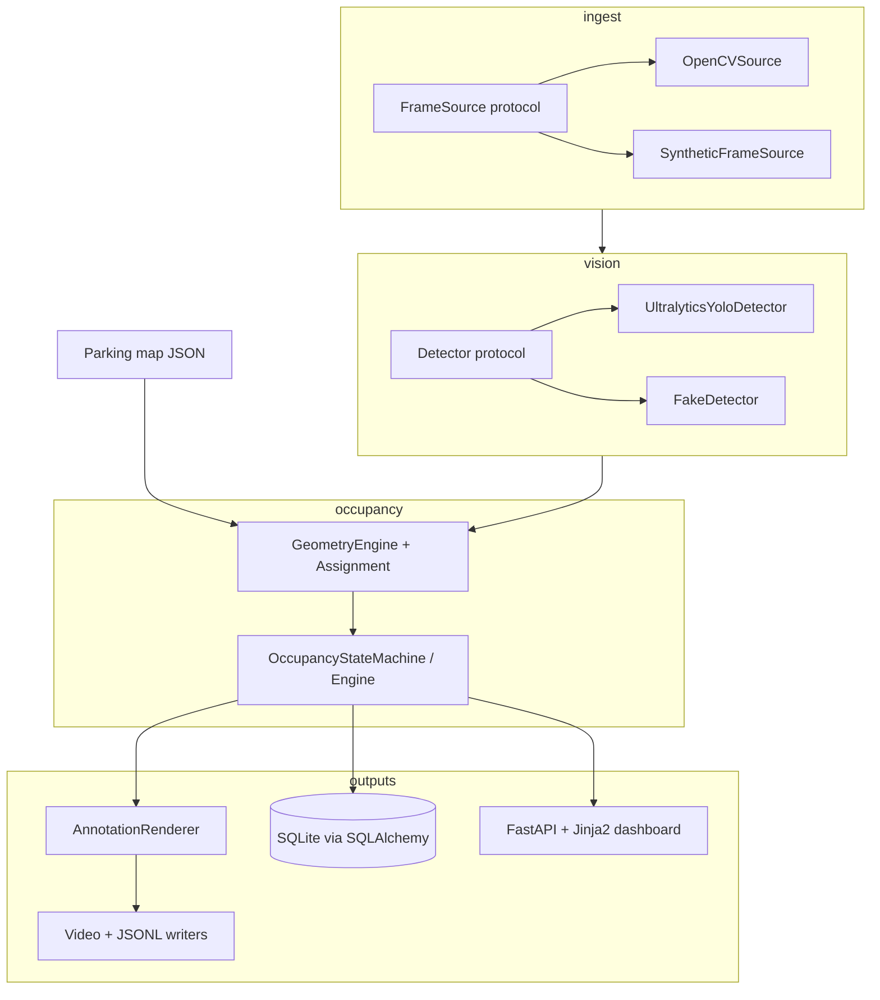

# Architecture

High-level design of Smart Parking-Space Detector v1.0.0.

## Goals

- Process a fixed-camera source (file, webcam, RTSP, or synthetic).
- Detect vehicles with a pluggable detector (Ultralytics YOLO or FakeDetector).
- Score detections against manually configured parking polygons.
- Stabilize occupancy with hysteresis and temporal confirmation.
- Persist confirmed transitions, expose CLI/API/dashboard outputs.

## Component diagram



## Data flow (one processed frame)

1. **Read** a frame and UTC metadata from the active `FrameSource`.
2. **Sample** according to `video.process_every_n_frames`.
3. **Detect** vehicles → normalized `DetectionBatch` (boxes, scores, class names, optional track IDs).
4. **Score** each detection against each parking polygon (overlap weights, footprint height ratio, center cues).
5. **Assign** detections to spaces with deterministic one-to-one matching above candidate thresholds.
6. **Update** per-space state machines (pending → confirmed `occupied` / `available`, or `unknown`).
7. **Emit** snapshot + optional occupancy events (idempotent keys when persistence is on).
8. **Render** overlays and optionally write annotated video / JSONL.
9. **Serve** the latest snapshot (and DB-backed history) through FastAPI.

## Package layout

```text
src/smart_parking/
  domain/          # Typed models and clocks
  config/          # Pydantic settings + parking-map IO
  sources/         # FrameSource adapters
  detection/       # YOLO + FakeDetector
  geometry/        # Overlap scoring and assignment
  state/           # Temporal occupancy engine
  pipeline/        # Orchestration, rendering, writers
  persistence/     # SQLAlchemy models, repository, analytics
  api/             # FastAPI app, routes, dashboard template
  evaluation/      # Occupancy metrics + throughput harness
  cli/             # Typer entrypoint (smart-parking)
```

## Configuration surfaces

| Surface | Examples |
| --- | --- |
| YAML | `configs/app.example.yaml` |
| Parking map | `configs/parking_spaces.example.json` |
| Environment | `SMART_PARKING_*` (see `.env.example`) |
| CLI overrides | `--source`, `--detector`, `--persist`, `--database-url`, … |

Precedence and secret handling: [`configuration.md`](configuration.md).

## Runtime modes

| Mode | Command | Typical use |
| --- | --- | --- |
| Process | `smart-parking process` | Batch or live occupancy pipeline |
| Serve | `smart-parking serve` | Status API + dashboard |
| Edit | `smart-parking edit-spaces` | Draw parking polygons |
| Benchmark | `smart-parking benchmark` | Synthetic FakeDetector throughput |
| DB / export | `smart-parking db …`, `export-events` | Schema, retention, CSV/JSON export |

## Design constraints (v1)

- Fixed camera; manual polygons; no auto bay discovery.
- CPU-compatible path required; GPU optional.
- Synthetic + FakeDetector path must remain weight-free for CI and smoke tests.
- No secrets in the repository; credentials only via local env / runtime.

## Related docs

- [`pipeline.md`](pipeline.md) — processing loop
- [`detection.md`](detection.md) — models and licensing
- [`geometry.md`](geometry.md) — scoring and assignment
- [`state.md`](state.md) — hysteresis tuning
- [`persistence.md`](persistence.md) — SQLite schema
- [`api.md`](api.md) — HTTP surface
- [`deployment.md`](deployment.md) — containers and ops
